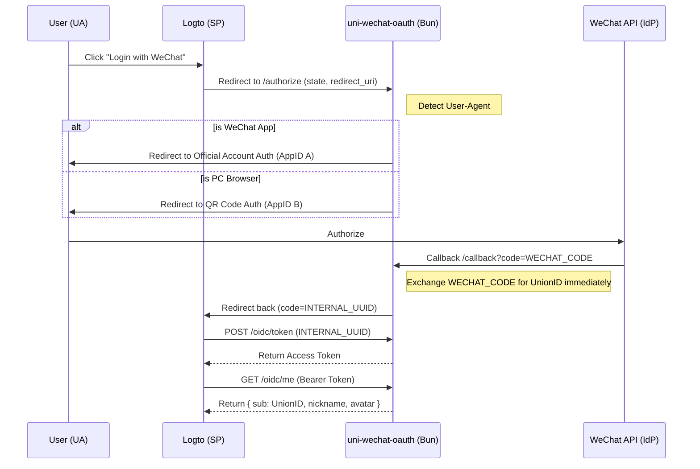

# uni-wechat-oauth

[!Runtime [<sup>1</sup>](https://img.shields.io/badge/runtime-Bun-black?style=flat-square&logo=bun)](https://bun.sh)
[!License [<sup>2</sup>](https://img.shields.io/badge/license-MIT-green?style=flat-square)](LICENSE)
[!Protocol [<sup>3</sup>](https://img.shields.io/badge/protocol-OAuth2.0%20%2F%20OIDC-blue?style=flat-square)](https://oauth.net/2/)

**uni-wechat-oauth** is a high-performance identity proxy (KVM-style switcher) built with Bun [<sup>4</sup>](https://bun.sh). It unifies the fractured WeChat ecosystem (Official Accounts vs. Open Platform) into a single, standard OAuth2/OIDC provider.

Designed specifically to act as a **Social Connector for Logto** or any other SP (Service Provider).

## 🚀 The Problem
WeChat treat "In-App Browser" (Official Accounts) and "PC Browsers" (Open Platform/QR Code) as two entirely different entities with different AppIDs, Secrets, and Auth Endpoints. This makes integrating "Login with WeChat" a nightmare for modern Auth services like Logto that expect a single configuration.

## ✨ Features
- **User-Agent Aware Routing**: Automatically detects if the user is inside WeChat or on a PC and redirects to the appropriate WeChat auth portal.
- **Identity Unification**: Maps different WeChat OpenIDs to a single `UnionID`, ensuring consistent user identity across all platforms.
- **Stateless/Lightweight**: Optimized for Bun's high-speed I/O.
- **OIDC Compatible**: Provides standard `/token` and `/me` endpoints, acting as a bridge for Logto.
- **Internal Code Mapping**: Bypasses WeChat's "code-used-once" restriction by implementing a secure internal exchange mechanism.

## 🛠 Architecture



## 📦 Installation

Ensure you have Bun [<sup>4</sup>](https://bun.sh) installed.

```bash
git clone https://github.com/your-username/uni-wechat-oauth.git
cd uni-wechat-oauth
bun install
```

## ⚙️ Configuration

Create a `.env` file in the root directory:

```env
PORT=3000
HOST=https://your-auth-proxy.com

# WeChat Official Account (Inside WeChat)
WX_MP_APPID=wx1234567890abcdef
WX_MP_SECRET=secret_here

# WeChat Open Platform (PC Scan)
WX_OPEN_APPID=wx0987654321fedcba
WX_OPEN_SECRET=secret_here

# Security
JWT_SECRET=your_random_string_here
```

> **Note:** Both WeChat applications MUST be linked under the same WeChat Open Platform Console [<sup>5</sup>](https://open.weixin.qq.com) to share the same `UnionID`.

## 🚀 Deployment

### Using Bun (Native)
```bash
bun start
```

### Using Docker
```bash
docker build -t uni-wechat-oauth .
docker run -p 3000:3000 --env-file .env uni-wechat-oauth
```

## 🔧 Integration with Logto

1.  **Create a Social Connector**: In Logto, create a "Custom Connector" (OAuth 2).
2.  **Authorization Endpoint**: `https://your-proxy.com/authorize`
3.  **Token Endpoint**: `https://your-proxy.com/oidc/token`
4.  **User Info Endpoint**: `https://your-proxy.com/oidc/me`
5.  **Redirect URI**: Logto will provide this, ensure it's added to your proxy's allowed list.

## 📄 License
MIT © [Your Name/Organization]

---

### Why Bun?
Bun's native SQLite support and blazing-fast HTTP server allow **uni-wechat-oauth** to handle thousands of concurrent auth requests with sub-millisecond overhead, making it the perfect "invisible" middleman for your auth flow.
